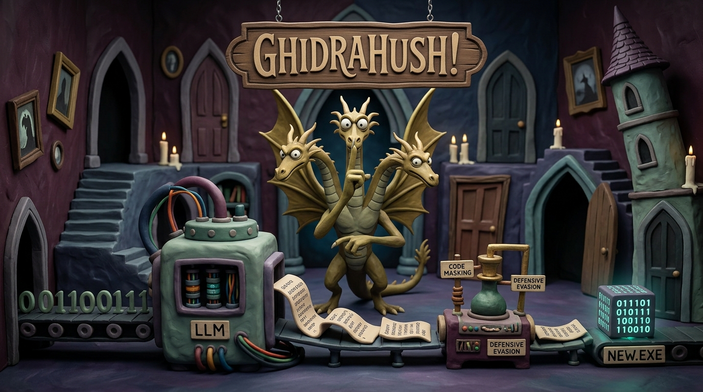

# GhidraHush



GhidraHush is a binary reverse engineering and orchestration toolchain. Designed for security researchers, it leverages the Ghidra decompiler API and Large Language Models (LLMs) to extract, refactor, and enhance C/C++ code. This creates a powerful framework for malware analysis, threat hunting, and executing structural mutation and robustness testing on compiled binaries.

**Important:** This pipeline is **not totally automated**. It operates on a "human-in-the-loop" philosophy. While the toolchain handles heavy lifting like extraction, LLM interactions, and compilation loops, user oversight—especially for filtering functions and verifying logic—is strictly required for maximum accuracy.

> **Disclaimer:** **For Educational Purposes Only!**
> GhidraHush is created strictly for research, education, and authorized security assessments. I accept zero responsibility for what you do with this tool. If you decide to do something reckless and end up behind bars, just know I won't be coming to break you out or pay your bail! Use it responsibly.

## 🌟 The Golden Rule: Tune Your Ghidra

It is absolutely crucial to tune your Ghidra environment before starting the decompilation process. It does not matter even if you have the best sources available and have access to the strongest LLM in the world; if you don't tune Ghidra to give you clean, accurate outputs in the first stage, the LLM will likely struggle to understand the code and context easily. **Just like a guitar, you must tune your Ghidra before playing.**

To achieve optimal decompilation quality, `GhidraHush` automates several core tuning steps directly within `function_extractor.py`:

* **Custom GDT Archives:** If your target binary uses structures or data types that are not part of Ghidra's default type system, you must create a custom Ghidra Data Type (`.gdt`) archive. The extraction pipeline automatically checks the `gdt_archives/` directory and loads all `.gdt` files directly into the program's data type manager before decompilation begins.
* **Compiler Helper Fixups:** Decompilers often misinterpret compiler-generated helper routines, leading to corrupted stack layouts and incorrect variable boundaries. The `function_extractor.py` script automatically cleans these up so stack items resolve accurately:
* **MinGW Stack Probes (`chkstk_ms`):** MinGW binaries use stack probes that pollute register state during decompilation. The script locates references to `chkstk_ms` and NOPs out the call sites. This preserves the `EAX` register (which holds the allocation size) and enables Ghidra to calculate local stack frame allocations correctly.
* **MSVC Stack Allocators (`chkstk`, `alloca_probe`):** For Microsoft-compiled binaries, the script disables inlining on stack allocation functions and explicitly applies the `__chkstk` call fixup to restore accurate stack layout signatures.
* **Security Cookie Checks (`security_check_cookie`):** Stack security check routines are forced to inline, removing control flow noise so the decompiler can output clear, uncluttered pseudocode.


## Input Requirements & Workspace

To get the most out of GhidraHush, please observe the following input guidelines:

* **Binary State:** It is highly preferred that the input binary is not stripped.
* **PDB Files:** If the binary was compiled with MSVC, providing a `.pdb` file ensures maximum decompilation accuracy. If a PDB is provided, it **must** have the exact same base name as the binary (e.g., `malware.exe` and `malware.pdb`) and be located in the same directory.
* **Workspace Isolation:** Every binary should be copied inside the `workspace` directory before usage. The control script automatically handles this by allocating a new `workspace/run_X` directory for each session. This folder will securely contain your binary, its PDB (if present), and all pipeline outputs.

## Project Architecture

The repository is structured to separate orchestration infrastructure from application logic. Here is a breakdown of what each core component is responsible for:

* **`/` (Root Infrastructure):**
* `docker-compose.yaml`: Defines the containerized services, mapping volumes and setting up the LLM environment (Ollama) with GPU support.
* `Dockerfile`: Builds the `GhidraHush` container, installing dependencies including Python 3.11, OpenJDK 21, Ghidra 12.1.2, and MinGW compilers for both 32-bit and 64-bit binaries.
* `GhidraReforger.sh`: The interactive Bash wrapper that serves as the entry point. It handles workspace directory creation, copies the target executable, tracks environment variables in `.env`, and launches the specific pipeline stages inside Docker.


* **`src/entry.py`:** The main Python orchestrator. It parses user arguments, detects the target binary's architecture (using `file` or `pefile`) to assign the correct compiler, and sequentially fires the pipeline stages. It also manages Abstract Syntax Tree (AST) syncing and proactive header patching.
* **`src/ghidra_scripts/function_extractor.py`:** A headless Ghidra script that analyzes the binary. It configures the decompiler, loads PDBs and custom GDT archives, resolves dynamic API calls, and applies preliminary filters to ignore standard library thunks and compiler-generated wrappers.
* **`workspace/`:** A dynamically generated I/O directory containing the isolated `run_X` folders where all extraction, LLM processing, and compilation takes place.

## Prerequisites

Ensure you have the following installed on your host system:

* [Docker](https://docs.docker.com/get-docker/)
* [Docker Compose](https://docs.docker.com/compose/install/)

## First-Time Setup

Before running the pipeline for the first time, you must build the environment and pull the required LLM into the Ollama service.

1. **Start the containers in detached mode:**

```bash
docker compose up -d

```

2. **Pull the LLM model into Ollama:**
*Note: Do this only the first time you want to use the program or if you need to update the model.*

```bash
docker compose exec ollama ollama run [the LLM of your choice]

```

## Usage & Human-in-The-Loop Workflow

The entire pipeline is controlled via the interactive Bash wrapper.

1. **Launch the menu:**

```bash
./GhidraReforger.sh

```

2. **Provide the target executable:**
When prompted, provide the path to your executable. The script will automatically generate a new `workspace/run_X/` directory and copy the binary there.
3. **Execute Stage 1.**
4. **⚠️ MANUAL INTERVENTION REQUIRED:**
After Stage 1 completes, navigate to `workspace/run_X/extracted_functions/`. You must manually review and remove useless functions, such as C/C++ runtimes or compiler-generated artifacts.
*Note: The script automatically filters out standard thunks, external functions, and functions with known prefixes (like `__scrt` or `std::`), but it cannot catch everything.*
5. **Resume the pipeline:** Once the extracted functions are cleaned up, return to the wrapper and proceed to Stage 2.

## Pipeline Stages Detail

The orchestration pipeline consists of 10 distinct phases:

1. **Extract functions from binary (Ghidra):** Automates the Ghidra headless analyzer to dump target functions. Crucially, if the binary uses evasion techniques like `getProcAddress` to hide its imports, this stage utilizes a dynamic `getProcAddress` resolver to propagate downstream types and reveal the true API calls.
2. **Extract global variables & data (Ghidra):** Extracts `.data` and `.bss` segments for state preservation.
3. **Beautify & refactor extracted C code (LLM):** Prompts the LLM agent to clean up decompiled pseudocode into standard C syntax.
4. **Resolve & add missing global declarations:** Stitches dependencies back into the refactored code and syncs the Abstract Syntax Tree (AST) to update C prototypes.
5. **Generate main wrapper script:** Generates a dynamic `main.c` wrapper for execution.
6. **Apply defensive evasion techniques:** Allows the user to dynamically select techniques (like junk code insertion, string encryption, or anti-debugging) to mutate the C code before compilation.
7. **Compile data_globals.c & main.c:** Uses `i686-w64-mingw32-gcc` or `x86_64-w64-mingw32-gcc` (depending on the binary architecture) to compile the baseline object files.
8. **Agentic compilation loop & patching (LLM):** An autonomous LLM-driven loop that attempts to compile the refactored functions, reads GCC error logs, and patches the source code until compilation succeeds (up to a max retry limit).
9. **Link output objects into final executable:** Links all generated `.o` files, `globals.o`, and `main.o` into the final executable.
10. **Verify behavioral equivalence:** (Currently under development) Designed to ensure the reconstructed binary matches the behavior of the original input.

## Contributing

Contributions are more than welcome! This project thrives on community collaboration. Whether you want to squash bugs, refine prompt engineering for the LLM agents, add novel evasion techniques, or expand custom GDT archives—your participation is heavily encouraged!

Feel free to fork the repository, open issues, or submit Pull Requests. Jump in and help take this framework to the next level!

## Notes

* Any changes made to Python files inside `src/` are instantly reflected in the container via volume mounts. You do not need to rebuild the Docker image when modifying application logic.
* You only need to run `docker compose build` if you modify system-level dependencies in the `Dockerfile` or `requirements.txt`.
