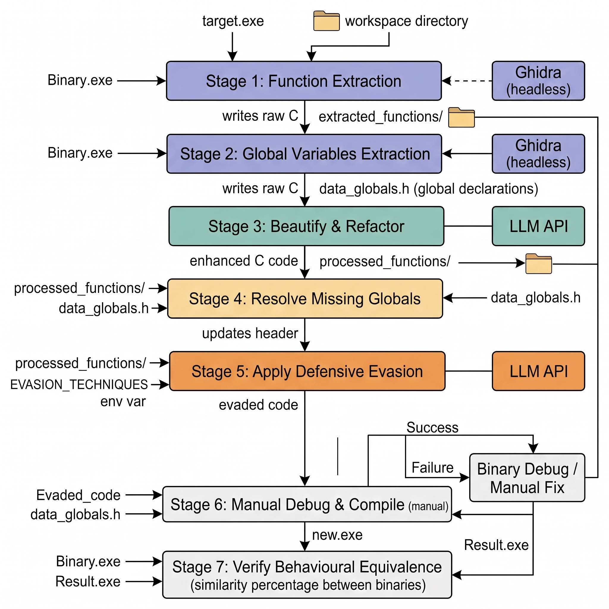

# GhidraHush


GhidraHush is an LLM-assisted binary reverse engineering and automated code refactoring framework. Designed for threat analysis, security research, and binary modification, it pairs headless **Ghidra decompilation APIs** with local **Large Language Models (Ollama)** to extract, clean, beautify, and refactor decompiled C code.

---

## Navigation
* [Overview](#overview)
* [Ghidra Pre-Decompilation Tuning](#ghidra-pre-decompilation-tuning)
* [Input Requirements & Workspace Isolation](#input-requirements--workspace-isolation)
* [System Architecture](#system-architecture)
* [Core Components & Utility Scripts](#core-components--utility-scripts)
* [Stage 2 vs. Stage 4 Tradeoffs](#stage-2-vs-stage-4-tradeoffs)
* [Prerequisites & Environment Setup](#prerequisites--environment-setup)
* [Execution Workflow](#execution-workflow)
* [Notes & Development](#notes--development)
* [Disclaimer](#disclaimer)

---

## Overview

GhidraHush operates on a **Human-in-the-Loop** execution model. While the framework handles extraction, compilation loops, and LLM transformations, user oversight is required—specifically during function filtering and logic verification—to ensure structural fidelity and eliminate decompiler noise.

---

## Input Requirements & Workspace Isolation

For optimal decompilation quality, observe the following guidelines:

* **Binary State:** Unstripped binaries are strongly preferred.
* **PDB Symbols (MSVC):** If analyzing MSVC targets with accompanying `.pdb` files, ensure the PDB shares the exact base name as the binary (e.g., `target.exe` and `target.pdb`) and resides in the same directory.
* **Workspace Isolation:** All analysis operations execute inside isolated `workspace/run_X/` directories. Target binaries, PDBs, intermediate extractions, and LLM logs are self-contained per execution session.

---

## Prerequisites & Environment Setup

### System Requirements

* Linux host environment
* Docker & Docker Compose
* GPU Acceleration (Recommended for local LLM inference)

### Initialization

1. **Start container infrastructure:**
```bash
docker compose up -d

```
2. **Pull local model weights into Ollama:**
```bash
docker compose exec ollama ollama run [MODEL_NAME]

```

*Note: Security-tailored models such as WhiteRabbitNeo weights yield strong results for C code refactoring.*
3. **Set target model:**
Specify your downloaded model name in the root `.env` file under `LLM_MODEL`.


---
## Usage

1. **Execute interactive runner:**
```bash
./GhidraHush.sh
```

2. **Load Target:** Enter the path to the executable. The script provisions `workspace/run_X/`.
3. **Execute Stage 1:** Run automated headless Ghidra decompilation and dynamic API resolution.
4. **Manual Intervention:** Inspect `workspace/run_X/extracted_functions/`. Delete compiler runtime wrappers, standard C/C++ thunks, or uninteresting setup functions before proceeding.
5. **Resume Execution:** Return to `./GhidraHush.sh` and execute Stages 2 through 5.


---


## Ghidra Pre-Decompilation Tuning

> *"Just like a guitar, you must tune your Ghidra before playing."*

Subpar decompiler output degrades LLM performance. To guarantee high-quality pseudocode prior to model ingestion, `src/ghidra_scripts/function_extractor.py` enforces the following automated pre-decompilation passes:

| Target Fixup | Implementation Mechanism |
| :--- | :--- |
| **Custom GDT Archives** | Automatically parses and loads custom `.gdt` type definitions from `gdt_archives/` into Ghidra’s Type Manager before extraction begins. |
| **Dynamic API Resolution** | Traces P-Code around `GetProcAddress` calls, resolves target API strings in memory, matches them against loaded GDT definitions, and propagates function pointer signatures downstream. |
| **MinGW Stack Probes (`chkstk_ms`)** | Identifies `chkstk_ms` call sites and NOPs them out. Preserves the `EAX` allocation size register and enables accurate local stack frame calculation. |
| **MSVC Stack Allocators (`chkstk`)** | Disables inlining on Microsoft stack allocation functions and applies explicit `__chkstk` call fixups to restore stack frame layout signatures. |
| **Security Cookie Checks** | Forces inlining on `security_check_cookie` routines to eliminate control flow noise around stack cookies. |

---

## Workflow



---

## System Architecture

```text
GhidraHush/
├── docker-compose.yaml        # Infrastructure orchestration (Ghidra, Python, Ollama)
├── Dockerfile                 # Image specs (Python 3.11, OpenJDK 21, Ghidra 12.1.2)
├── GhidraHush.sh              # Interactive CLI entry point
├── src/
│   ├── entry.py               # Main orchestrator (AST sync, header patching)
│   ├── ghidra_scripts/        # Headless Ghidra automation
│   │   ├── function_extractor.py
│   │   └── extract_global_data.py
│   ├── llm/                   # LLM integration & transformation engines
│   │   ├── base_agent.py
│   │   ├── c_code_enhancer.py
│   │   └── evasion_techniques.py
│   └── utils/                 # Binary parsing & P-Code tracing
│       ├── getprocaddress_resolver.py
│       └── add_missing_globals.py
└── workspace/                 # Dynamic run-isolated session outputs

```

---

## Core Components & Utility Scripts

### `src/utils/getprocaddress_resolver.py`

Resolves dynamically loaded APIs in obfuscated binaries. Performs P-Code analysis around `GetProcAddress` calls, extracts string parameters from memory, maps signatures against `.gdt` type archives, and updates variable definitions and callee parameter lists.

### `src/ghidra_scripts/extract_global_data.py` [Stage 2]

Parses defined `.data` and `.bss` memory blocks via PyGhidra. Converts structs, unions, enums, string constants, and static buffers directly into C-compliant headers (`data_globals.h`) and implementations (`data_globals.c`).

### `src/utils/add_missing_globals.py` [Stage 4]

Performs a secondary parsing pass on refactored `.c` function files to detect un-declared identifiers missing from `data_globals.h`. Resolves memory offsets via Ghidra's symbol table and appends array/structure definitions.

### `src/llm/base_agent.py`

Base client (`BaseLLMAgent`) handling communication with the local Ollama instance, response streaming, Markdown block parsing, and session logging inside `llm_logs/`.

### `src/llm/c_code_enhancer.py`

Applies a multi-pass C beautification and normalization sequence:

1. **Pass 1:** Standardizes types (`<stdint.h>`), renames generic identifiers, and strips compiler artifacts (e.g., `__RTC_CheckEsp`).
2. **Pass 2:** Transforms raw pointer arithmetic into array indexing, restores explicit casts, and formats system API call signatures.
3. **Pass 3:** Eliminates unnecessary `goto` statements, simplifies control flow, and prepares standard C99/C11 code.
4. **Topological Sort:** Sorts C functions using a call-graph dependency tree so callees are beautified and prototyped prior to their callers.

### `src/llm/evasion_techniques.py`

Applies structural mutation and obfuscation engines (`DefensiveEvasion` class) to generated C functions:

* **Junk Code Insertion:** Injects dead code branches driven by opaque predicates and system APIs.
* **Stack-String XOR Encryption:** Replaces raw string literals with runtime-decrypted stack character arrays.
* **Variable Aliasing:** Converts scalar variable assignments into multi-pointer stack arrays.
* **Control Flow Flattening:** Flattens structured execution into state machines utilizing `goto` dispatchers.

---

## Stage 2 vs. Stage 4 Tradeoffs

```text
[ Stage 2: Direct Binary Memory Extraction ]
  └── High Fidelity: Pulls directly from .data / .bss sections and symbol tables.

[ Stage 4: Heuristic Regex Parsing ]
  └── Low Fidelity Risk: Scans decompiled .c files. Can mistake temporary local 
      stack variables or decompiler noise for missing globals, polluting data_globals.h.

```

> **Recommendation:** Do not run Stage 4 (`add_missing`) unless verified global variables were skipped during Stage 2.

---

## Notes & Development

* **Live Reloading:** Modifications to files inside `src/` propagate directly to the running container via volume mounts without needing an image rebuild.
* **Container Rebuild:** Run `docker compose build` only when modifying Dockerfile layers or updating `requirements.txt`.

---

## Disclaimer

**For Authorized Educational and Security Research Purposes Only.**

GhidraHush is developed strictly for research, binary analysis education, and authorized assessments. The author assumes no liability for unauthorized or illegal use.
